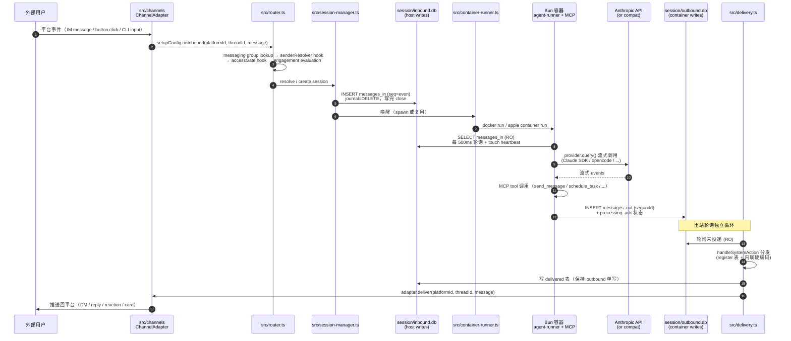

# NanoClaw v2 架构探索 — 二开导览图

> **日期**：2026-05-07（refreshed 2026-05-08）
> **方法**：Superpowers `brainstorming` skill · 4 个 Explore subagent 并行扫源码 → 汇总 → 画图 → 沉淀
> **范围**：NanoClaw v2 trunk（`src/` ~50 文件 + `container/agent-runner/src/` 33 文件 + `src/modules/` 7 子目录）
> **目的**：fork 之前先建全局图。NanoClaw 哲学是 "small enough to understand"，对应的纪律是"先理解、再动手"。

---

## 一、文件分类全景（按职责）

NanoClaw 是个**纯薄编排层**——`src/index.ts` 自述："Thin orchestrator: init DB, run migrations, start channel adapters, start delivery polls, start sweep, handle shutdown."

把 host 端 + container 端的代码按职责分成 **7 大类**：

### 1. 入口 & 编排（host）
| 文件 | 职责 |
|------|------|
| `src/index.ts` | 启动入口：DB init → migrations → channel adapters → delivery polls → sweep |
| `src/router.ts` | 入站路由：channel 事件 → messaging group → sender → agent → access gate → session → 写 inbound.db → 唤醒容器 |
| `src/delivery.ts` | 出站投递：轮询 outbound.db → 系统 action 分发 → channel adapter 推回平台 |
| `src/host-sweep.ts` | 60s sweep：processing_ack 同步、stale 容器检测、due-message 唤醒、recurrence |
| `src/session-manager.ts` | 会话生命周期、inbound/outbound DB 打开、heartbeat 路径 |
| `src/container-runner.ts` | 用 Docker/Apple Container 跑 per-agent-group 容器，挂载 session DB + outbox |
| `src/container-runtime.ts` | Runtime 抽象（docker / apple container / orphan 清理） |
| `src/webhook-server.ts` | HTTP 入口（Discord gateway forward 等） |

### 2. 消息进出层（src/channels/，8 文件）
| 文件 | 职责 |
|------|------|
| `adapter.ts` | **稳定 API**：`ChannelAdapter` 接口、`InboundMessage` / `OutboundMessage` schema |
| `channel-registry.ts` | `registerChannelAdapter()` 注册表 + `initChannelAdapters()` 生命周期 + 重试逻辑 |
| `chat-sdk-bridge.ts` | 把 OneCLI Chat SDK 适配成 `ChannelAdapter`（Discord/Slack/Telegram/...共用） |
| `cli.ts` | 内置本地 CLI channel（trunk 唯一随主分支的 adapter） |
| `ask-question.ts` | ask_user_question 选项归一化（裸字符串 → label/value/selectedLabel） |
| `index.ts` | barrel：哪些 channel 自注册——trunk 上只有 `cli.ts`，其他在 `channels` 分支 |

### 3. Provider 层（src/providers/）
- 仅 `claude` 烘焙进 trunk，`opencode` 等在 `providers` 分支，由 `/add-opencode` skill 安装
- host 侧的 provider config 决定容器额外 mount / env

### 4. 业务能力模块（src/modules/，7 子目录）
| 模块 | 层级 | 用途 |
|------|------|------|
| `approvals/` | 默认 | 审批原语：`requestApproval()` + `registerApprovalHandler()` |
| `permissions/` | 默认 | sender 解析、access gate、未知发送人/channel 审批 |
| `typing/` | 默认 | 容器活跃时刷新平台"输入中..."状态 |
| `interactive/` | 默认 | ask_user_question 响应处理 |
| `scheduling/` | 默认 | 一次性 + 循环任务（schedule_task / cancel / pause / resume） |
| `agent-to-agent/` | 默认 | agent 互相发消息 + create_agent |
| `self-mod/` | 默认 | install_packages / add_mcp_server（需审批 → 重建镜像） |
| `mount-security/` | 默认 | 容器挂载允许列表 |

### 5. 数据持久化层（src/db/）
- **central** `data/v2.db` — host 单写：users / agent_groups / messaging_groups / sessions / pending_approvals / wiring
- **session inbound.db** — host 写、container 只读：messages_in、destinations 投影、session_routing 投影、delivered
- **session outbound.db** — container 写、host 只读：messages_out、processing_ack、session_state、container_state
- 关键文件：`connection.ts`（central 单例）、`session-db.ts`（双 DB + seq parity）、`migrations/`（按 name 幂等）

### 6. 横切工具（host）
`config.ts`、`env.ts`、`log.ts`、`platform-id.ts`、`response-registry.ts`、`command-gate.ts`、`circuit-breaker.ts`、`attachment-naming.ts`、`attachment-safety.ts`、`claude-md-compose.ts`、`group-init.ts`、`group-folder.ts`、`install-slug.ts`、`timezone.ts`、`state-sqlite.ts`

### 7. Agent 容器内部（container/agent-runner/src/，33 文件）
| 子目录 | 职责 |
|--------|------|
| `index.ts` + `poll-loop.ts` | 容器主循环：load config → MCP server → poll inbound → format → provider.query → write outbound |
| `formatter.ts` + `destinations.ts` | 把 messages_in 行序列化成 XML prompt + 注入 destination map |
| `db/` | bun:sqlite 双 DB 层（inbound RO / outbound RW），journal_mode=DELETE 不变量 |
| `providers/` | provider 抽象 + `registerProvider()` 注册表（claude / mock / opencode） |
| `mcp-tools/` | `registerTools()` 注册表（core / scheduling / interactive / agents / self-mod） |
| `config.ts` | 读 `/workspace/agent/container.json` |

> **关键观察**：容器跑 **Bun**（启动 < 1s），host 跑 **Node + pnpm**。两套依赖树独立，**仅通过两个 SQLite 文件通信**——没有 IPC、没有 stdin、没有共享模块。

---

## 二、4 个核心模块的职责边界（二开必背）

### A. `src/channels/`（消息通道适配器）

**职责**：把 NanoClaw 接进任何外部消息系统。

**稳定 API**（`adapter.ts:110–167`）：
```typescript
interface ChannelAdapter {
  name: string;
  channelType: string;
  supportsThreads: boolean;
  setup(config: ChannelSetup): Promise<void>;
  teardown(): Promise<void>;
  isConnected(): boolean;
  deliver(platformId, threadId, message): Promise<string | undefined>;  // 必需
  setTyping?, syncConversations?, openDM?, subscribe?                    // 可选
}
```

**两种实现路径**：
1. **Native adapter**（如 `cli.ts`）：自己实现接口，直接调 `setupConfig.onInbound()`
2. **Chat SDK bridge**（Discord/Slack/Telegram/...）：包一层 `chat-sdk-bridge.ts`，平台 SDK 由 OneCLI 管理

**可改区**：新建 `channels/your-channel.ts` + `channel-registry.ts` 注册一行。
**红线**：不要改 `chat-sdk-bridge.ts` 的核心逻辑——7 个 Chat SDK 平台共用底座，改一处坏一片。

---

### B. `src/modules/`（业务能力模块）

**职责**：往核心流程挂"行为 hook"——每个模块自包含，通过向 router / delivery / response-registry 注册回调来扩展能力。

**6 大稳定扩展面**（这是 NanoClaw 唯一的"插件系统"）：

| 注册函数 | 位置 | 用途 |
|---------|------|------|
| `registerChannelAdapter(name, factory)` | `src/channels/channel-registry.ts` | 新 channel |
| `registerDeliveryAction(action, handler)` | `src/delivery.ts` | 新 system action（schedule_task / install_packages / create_agent...） |
| `registerApprovalHandler(action, handler)` | `src/modules/approvals/primitive.ts` | 新审批类型的 apply 回调 |
| `registerResponseHandler(handler)` | `src/response-registry.ts` | 用户回复（按钮 / 自由文本）的处理器 |
| `registerProvider(name, factory)` | `container/agent-runner/src/providers/provider-registry.ts` | 新 LLM provider |
| `registerTools([...])` | `container/agent-runner/src/mcp-tools/server.ts` | 新 MCP 工具 |

**3 类 router/host hook 注入点**（router.ts 暴露的回调式扩展点）：
- `setSenderResolver` / `setAccessGate` / `setSenderScopeGate` / `setChannelRequestGate` / `setMessageInterceptor`（permissions 模块挂这里）
- `setDeliveryAdapter` / `onDeliveryAdapterReady` / `setTypingAdapter`（delivery.ts）
- `MODULE-HOOK:` 注释标记（`host-sweep.ts:204` 调度循环、`poll-loop.ts` 任务前脚本）

**🔥 硬编码逃生口**（不走 registry，要扩展只能改 core）：
- `delivery.ts` 内联 `channel_type === 'agent'` 路由（agent-to-agent 走的）
- `delivery.ts` 内联 `content.type === 'ask_question'` pending_questions 写入
- 新增类似机制要么修 core，要么沿用现有路径

**可改区**：新建 `modules/your-module/`，参考 `scheduling/` 模板：`index.ts` 在 import 时调 register 函数、`db/` 放本模块独占的表 + migration。
**红线**：模块之间**禁止互相 import**——所有交互通过上述 6 个 registry。打破这条 = 反模式起点。

**模块加载顺序**（`src/modules/index.ts`）：approvals → interactive → scheduling → permissions → agent-to-agent → self-mod。`approvals` 必须先加载（其他模块导入时才能注册 handler）。

---

### C. `src/db/`（数据持久化）

**职责**：三 DB 架构的实现层。

**单写者铁律**：
- central `data/v2.db` —— host only
- session `inbound.db` —— host writes，container reads RO
- session `outbound.db` —— container writes，host reads RO
- **delivery 的 delivered 表写到 inbound.db**（不能写 outbound，会破坏 container 单写）

**Seq parity 不变量**：host 用 even seq（`nextEvenSeq()` in `session-db.ts:89`），container 用 odd——disjoint namespace 让 agent 用 seq 引用任何方向的消息（edit_message #5 不会跨方向歧义）。

**Migration 约定**：
- 按 `name` 幂等（不是 version 号），module migration 可以挑大编号
- `migrations/index.ts` runner 检查 `schema_version` 表去重
- 新增表：`migrations/NNN-foo.ts` + `db/foo.ts` 暴露 CRUD + barrel 导出

**红线**：
1. session DB **journal_mode=DELETE 不能改成 WAL**——跨容器挂载下 WAL 的 mmapped `-shm` 不会刷到 guest，会丢消息（`container/agent-runner/src/db/connection.ts:18` 的注释是权威说明）
2. host 写完必须 close 连接——长连接冻结 container 页缓存视图
3. 改 `inbound.db` / `outbound.db` 表 schema 必须双向同步——host 和 container 是两套独立运行时
4. central `agent_destinations` 改了，所有 alive container 的 `inbound.db::destinations` 投影变 stale——必须主动调 `writeDestinations()` 刷新

**ad-hoc 查询**：`pnpm exec tsx scripts/q.ts <db> "<sql>"`（不要用 `sqlite3` CLI——setup 不依赖它）。

---

### D. `container/`（Agent 容器化）

**职责**：把每个 agent group 跑在独立 Bun 容器里。

**输入/输出契约**（容器看到的 `/workspace/`）：
```
/workspace/
  inbound.db        ← host 写、container 读
  outbound.db      ← container 写、host 读
  .heartbeat       ← container 每 500ms touch（liveness）
  outbox/           ← 出站文件附件
  agent/            ← agent group 文件夹（CLAUDE.md / container.json）
  global/           ← 全局共享 memory（RO）
/app/src/           ← agent-runner 源码 RO bind mount（不烘焙进镜像）
/app/skills/        ← container skills
```

**stable 扩展点**：
- 新 provider：`providers/your.ts` + `registerProvider()` + barrel import
- 新 MCP tool：`mcp-tools/your.ts` + `registerTools([...])` + barrel import
- 新 container skill：`container/skills/your-skill/SKILL.md`（host 在 spawn 时挂载）
- 新 destination type：扩展 `destinations.ts` 的 `DestinationEntry`

**Bun gotchas**：
- `bun:sqlite` 命名参数要 `$` 前缀（不像 better-sqlite3 自动剥）
- 测试用 `bun:test`，不是 vitest（vitest 不能 load `bun:sqlite`）
- agent-runner 是独立 bun 包，不是 pnpm workspace——加依赖要 `cd container/agent-runner && bun install`

**红线**：
- 不要改 `Dockerfile` / `entrypoint.sh` 除非要重建 base image——install-slug label 用于 setup orphan 清理
- 入口必须是 `exec bun run /app/src/index.ts`（信号转发依赖）
- 镜像里没有 `/app/dist`——别引入 tsc build step

---

## 三、扩展点 vs 内部实现（upstream 冲突评估）

NanoClaw 没有传统插件系统——所有扩展都是改源码。要二开**就要 fork**。下表是冲突风险评级：

| 改动位置 | 冲突风险 | 推荐策略 |
|---------|:-------:|---------|
| 新 `src/channels/your.ts` + 注册一行 | 🟢 低 | upstream 合并基本无冲突 |
| 新 `src/modules/your-module/` + register 调用 | 🟢 低 | 同上 |
| 新 `container/agent-runner/src/mcp-tools/your.ts` | 🟢 低 | barrel import 加一行即可 |
| 新 provider（host + container 两侧） | 🟢 低 | 参考 `providers` 分支的 opencode 模式 |
| `groups/{folder}/CLAUDE.md` | 🟢 零 | 用户数据，不在 git 跟踪 |
| `container/CLAUDE.md`（base prompt） | 🟡 中 | upstream 偶尔会改，patch 维护即可 |
| `src/db/migrations/` 加新表 | 🟡 中 | migration 用大编号 5xx+ 避让 upstream |
| `src/router.ts` / `src/delivery.ts` 加新 hook 点 | 🔴 高 | 优先用现有 register；非加不可时提 PR 给 upstream |
| 改 `delivery.ts` 内联硬编码（agent / ask_question） | 🔴 高 | 强烈不推荐——重构成 registry 再改 |
| `src/container-runner.ts` 改容器启动逻辑 | 🔴 高 | base image 假设固定，几乎不要碰 |
| `Dockerfile` / `entrypoint.sh` | 🔴 极高 | install-slug 机制依赖它，改了让 setup orphan 清理失效 |

**🔥 关键观察**：NanoClaw 通过 `channels` / `providers` 两个长期分支 + `/add-*` skill 把"可选适配器"从 trunk 隔离出去——fork 时只改 trunk，channel/provider 升级走 skill 走分支，**结构上避免了 90% 的合并冲突**。

---

## 四、消息端到端流程（mermaid）



**关键不变量（图里塞不下、二开必须记住）**：
- session 的 inbound.db 和 outbound.db 是**两个独立文件**，不是一个 DB 两张表——为了"单写者"
- host 永远不写 outbound.db，container 永远不写 inbound.db——跨容器 SQLite 的硬约束
- delivery 不删 outbound，靠 inbound.db 的 `delivered` 表记账
- host=even seq、container=odd seq——disjoint namespace 给 agent 用 seq 跨方向引用
- 容器内只有 `outbound.db` 的 single-writer 锁，所有 MCP tool 都写它

---

## 五、二开起手式（按场景）

| 我想做的事 | 改哪里 | 模板参考 |
|-----------|--------|---------|
| 接一个新 IM 平台 | `src/channels/your.ts` + register | `cli.ts`（native）或 `chat-sdk-bridge.ts`（SDK 桥） |
| 加一种审批类型 | `modules/approvals/` 内调用 + `registerApprovalHandler()` | `self-mod/apply.ts` |
| 加一种调度任务 | `modules/scheduling/` + `registerDeliveryAction()` | `scheduling/actions.ts` |
| 让 agent 调一个新工具 | `container/agent-runner/src/mcp-tools/your.ts` + `registerTools()` | `mcp-tools/core.ts` |
| 接一个新 LLM | `container/agent-runner/src/providers/your.ts` + `registerProvider()` | `providers/claude.ts` |
| 改 agent 行为/人设 | `groups/<folder>/CLAUDE.md` | 不需要改源码 |
| 加新表存东西 | `src/db/migrations/5XX-foo.ts` + `db/foo.ts` | `migrations/008-*.ts` |

---

## 六、本次探索的元层学习

> 用 brainstorming skill 做"代码考古"而非"写需求"是隐藏用法。本次方法论：

1. **先看 entry point 文件头注释**：`src/index.ts` 的自述往往就是项目最佳一句话总结。
2. **看子目录文件分布**：`src/modules/` 7 子目录、`container/agent-runner/src/` 33 文件、`src/channels/` 8 文件——直接告诉你"业务复杂度集中在哪"。
3. **找 register 函数**：在一个"无插件系统"的项目里，所有 `register*` / `setXxx` 函数就是它的事实插件系统。本次找到 6 个核心 registry。
4. **找 MODULE-HOOK 注释**：源码里的 `MODULE-HOOK:` 标记是设计者明确画出的"这里允许扩展"边界。
5. **找硬编码逃生口**：`delivery.ts` 里两处内联 if 提醒——不是所有扩展点都被 registry 覆盖，要诚实标出。
6. **画图前先列名词链**：channel → router → session → inbound DB → container → API → outbound DB → delivery → channel。链路有了，mermaid 就是把它画出来。
7. **冲突风险表是 fork 的护栏**：哪改了 upstream 合并不冲突 / 哪改了死活不能合，必须显式列出。NanoClaw 通过 `channels` / `providers` 分支策略已经把大部分冲突结构性消解。

---

> **下一步**：本份探索作为 spec 沉淀。后续会话直接 reference 此文件，不需要重新探索整个 codebase。
