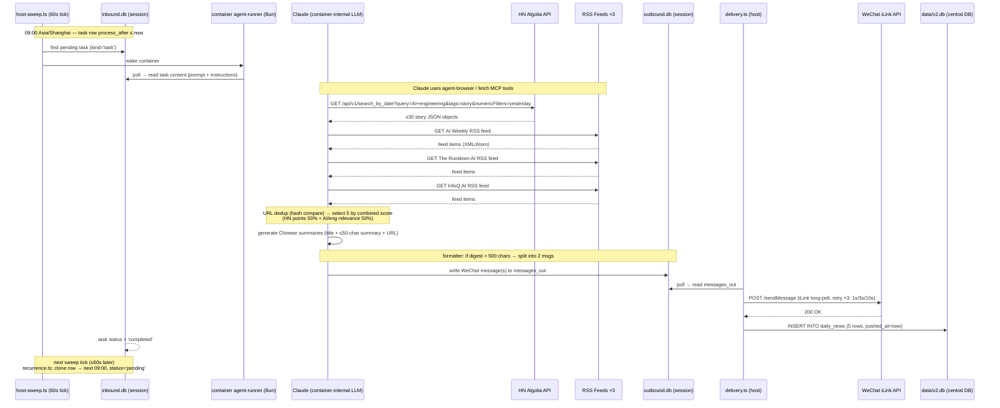
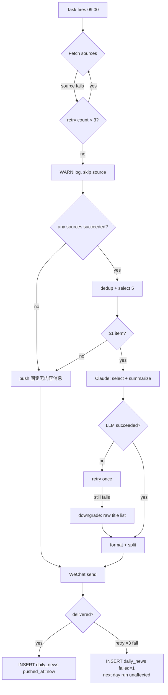

# Implementation Plan: daily-news-agent

**Branch**: `daily-news-agent` | **Date**: 2026-05-11 | **Spec**: [spec.md](./spec.md)  
**Input**: `specs/daily-news-agent/spec.md` (Clarification Log CL-01 ~ CL-10 already fused)

---

## Summary

Build a recurring 09:00 Asia/Shanghai news digest that fetches HN + 3 RSS sources, has the container-internal Claude agent select and summarize 5 AI/engineering stories in Chinese, and delivers via the WeChat channel wired to `cli-with-muyu`. All host orchestration code lives in `src/modules/daily-news/`; LLM selection and summarization happens inside the existing agent container (no new API calls, no new LLM infrastructure). Persistence uses a new `daily_news` table added by migration `014` to the central DB (`data/v2.db`).

---

## Technical Context

**Language/Version**: TypeScript / Node 20 (host module); Bun (agent container — no new container code)  
**Primary Dependencies**: `rss-parser@3.13.0` (RSS), `better-sqlite3` (already present), Node built-in `fetch`  
**Storage**: Central SQLite `data/v2.db` — new `daily_news` table via migration 014  
**Testing**: vitest (host), `bun:test` (container — no new container tests required)  
**Target Platform**: macOS (launchd) / Linux (systemd) — NanoClaw host process  
**Project Type**: NanoClaw host module + scheduled agent task  
**Performance Goals**: Digest delivered ≤ 60 s after 09:00 Asia/Shanghai (sweep precision ±60 s)  
**Constraints**: Claude input ≤ 4,000 tokens; per-item summary ≤ 50 Chinese chars; total digest ≤ 500 chars before split; 3 source-level retries; 3 WeChat delivery retries with exponential backoff  
**Scale/Scope**: 1 fetch + 1 WeChat push per day; well within HN API and WeChat iLink rate limits

---

## Constitution Check

| Gate | Status | Notes |
|------|--------|-------|
| No new external LLM API calls | ✅ PASS | Summarisation uses container-internal Claude (the agent itself) |
| No bypass of scheduling module | ✅ PASS | Uses `src/modules/scheduling/db.ts → insertTask()` directly |
| No new DB files or engines | ✅ PASS | Extends `data/v2.db` via standard migration |
| Code placement in `src/modules/daily-news/` | ✅ PASS | No root-level files |
| Pre-requisite skill runs first | ✅ PASS | `/add-wechat` must be executed before `setup.ts` |
| TDD: tests before implementation | ✅ REQUIRED | Every `.ts` module → corresponding `.test.ts` written first |

---

## File Structure

### Spec Documentation

```text
specs/daily-news-agent/
├── brainstorming.md   (existing)
├── spec.md            (existing)
├── plan.md            (this file)
├── research.md        (Phase 0 — to be generated)
├── data-model.md      (Phase 1 — to be generated)
└── tasks.md           (Phase 2 — /speckit-tasks output)
```

### Source Code

```text
src/
├── modules/
│   └── daily-news/
│       ├── index.ts              # Module entry: exports setup + registers delivery hook
│       ├── config.ts             # RSS URLs, CRON_EXPR, TZ, WECHAT_GROUP_PLATFORM_ID, MAX_ITEMS, MAX_CHARS
│       ├── types.ts              # Interfaces: RawNewsItem, NewsItem, FetchResult, DailyDigest, DeliveryRecord
│       ├── fetcher.ts            # HN Algolia API + rss-parser; per-source 3-retry with WARN on fail
│       ├── dedup.ts              # URL exact-match via short hash (pure function, no side effects)
│       ├── prompt-builder.ts     # Builds the Claude task prompt with yesterday's date + article list
│       ├── formatter.ts          # WeChat message template + 500-char split logic (pure)
│       ├── db.ts                 # daily_news CRUD: insertItems, markFailed, getPendingRepush
│       ├── setup.ts              # One-time: inserts recurring schedule_task into session inbound.db
│       └── runner.ts             # Integration smoke-runner (manual trigger for dev/test)
│
└── db/
    └── migrations/
        └── 014-daily-news.ts     # Adds daily_news table + indexes to data/v2.db

src/modules/daily-news/
tests (co-located):
├── fetcher.test.ts
├── dedup.test.ts
├── prompt-builder.test.ts
├── formatter.test.ts
├── db.test.ts
└── setup.test.ts
```

**Structure Decision**: Single host module under `src/modules/daily-news/` — no new container code. The agent container's Claude agent processes the task prompt using its built-in MCP fetch capability (`agent-browser`). The host module manages setup, DB persistence, and message formatting utilities.

---

## Data Flow Diagram



### Failure Branch



---

## NanoClaw Integration Points

### 1. `schedule_task` MCP Tool — Concrete Call

The task is created once by running `setup.ts` (or by the admin instructing the cli-with-muyu agent directly). The agent-side MCP call the agent makes during setup is:

```typescript
// Called by the agent inside cli-with-muyu session (container, Bun)
// container/agent-runner/src/mcp-tools/scheduling.ts → scheduleTask.handler()

await schedule_task({
  prompt: `## 每日 AI 工程新闻任务

执行以下步骤，完成今日 AI 新闻摘要并推送到微信群：

### Step 1 — 抓取 HackerNews（昨日故事）
请求 HN Algolia API，取昨日发布的 AI/工程类故事（最多 30 条）：
  GET https://hn.algolia.com/api/v1/search_by_date?query=AI+LLM+engineering&tags=story&hitsPerPage=30&numericFilters=created_at_i>[YESTERDAY_UNIX],created_at_i<[TODAY_UNIX]

### Step 2 — 抓取 RSS 源（各取最新 20 条）
  - AI Weekly:       https://aiweekly.co/issues.rss
  - The Rundown AI:  https://api.therundown.ai/rss
  - InfoQ AI:        https://feed.infoq.com/news/ai-ml-data-eng

任一源抓取失败：重试 1 次，仍失败则跳过并记录警告，继续处理其余源。

### Step 3 — 去重
对所有条目按 URL 精确匹配去重（保留第一次出现）。

### Step 4 — 选出 5 条
综合评分：HN points 权重 50%、AI/ML/LLM/工程工具相关度（你的判断）50%。
若去重后不足 5 条，取全部。若 0 条，输出固定消息（见 Step 6）。

### Step 5 — 生成中文摘要
每条格式：
  【标题】（中文，适当意译）
  【摘要】1-2 句，≤ 50 字
  【来源】原始 URL

### Step 6 — 发送到微信群
目标群 platform_id: wechat:REPLACE_WITH_GROUP_ID
若摘要总长 > 500 字符，拆分为 2 条连续消息，不截断任何条目。
若 0 条可用内容：发送"今日 AI 工程领域无显著动态，明日 9:00 再见"。

若 LLM 摘要生成失败：重试一次；仍失败则降级为纯标题列表发送，不留空。`,

  processAfter: "2026-05-12T09:00:00",   // naive local → interpreted as Asia/Shanghai by parseZonedToUtc()
  recurrence:   "0 9 * * *",             // daily at 09:00, evaluated in TIMEZONE from config.ts
});
```

**Host-side equivalent** (for `setup.ts` — direct DB insert without needing an active session):

```typescript
// src/modules/daily-news/setup.ts
import Database from 'better-sqlite3';
import { insertTask } from '../scheduling/db.js';
import { nextEvenSeq }  from '../../db/session-db.js';
import { buildTaskPrompt } from './prompt-builder.js';
import { WECHAT_CHANNEL_TYPE, WECHAT_GROUP_PLATFORM_ID } from './config.js';

export function registerDailyNewsTask(inboundDb: Database.Database): string {
  const id = `task-daily-news-${Date.now()}-${Math.random().toString(36).slice(2, 8)}`;
  const tomorrow9am = getNext9amShanghai(); // util in prompt-builder.ts

  insertTask(inboundDb, {
    id,
    processAfter: tomorrow9am,
    recurrence:   '0 9 * * *',          // cron-parser reads this with tz: 'Asia/Shanghai'
    platformId:   WECHAT_GROUP_PLATFORM_ID,
    channelType:  WECHAT_CHANNEL_TYPE,
    threadId:     null,
    content: JSON.stringify({
      action: 'schedule_task',
      taskId: id,
      prompt: buildTaskPrompt(),
      script: null,
      processAfter: tomorrow9am,
      recurrence:   '0 9 * * *',
      platformId:   WECHAT_GROUP_PLATFORM_ID,
      channelType:  WECHAT_CHANNEL_TYPE,
      threadId:     null,
    }),
  });
  return id;
}
```

### 2. `/add-wechat` Skill Call Path

Pre-requisite: execute `/add-wechat` before the first scheduled run. Steps (idempotent):

```bash
# Step 1 — fetch channels branch
git fetch origin channels

# Step 2 — copy WeChat adapter into host
git show origin/channels:src/channels/wechat.ts > src/channels/wechat.ts

# Step 3 — wire import (append if not already present)
echo "import './wechat.js';" >> src/channels/index.ts

# Step 4 — install pinned library
pnpm install wechat-ilink-client@0.1.0

# Step 5 — build
pnpm run build

# Step 6 — add to .env and restart
echo "WECHAT_ENABLED=true" >> .env
mkdir -p data/env && cp .env data/env/env
launchctl kickstart -k gui/$(id -u)/com.nanoclaw  # macOS
# systemctl --user restart nanoclaw                 # Linux

# Step 7 — QR scan
cat data/wechat/qr.txt   # open URL in browser → scan with WeChat app

# Step 8 — get group platform_id (after group sends a message to the bot)
grep 'WeChat inbound' logs/nanoclaw.log | tail -1
# → "WeChat inbound platformId=wechat:<group_id>"
# → update WECHAT_GROUP_PLATFORM_ID in src/modules/daily-news/config.ts

# Step 9 — wire group to cli-with-muyu agent group
pnpm exec tsx .claude/skills/add-wechat/scripts/wire-dm.ts \
  --platform-id  wechat:<group_id> \
  --agent-group  ag-1778127817315-jlhkmo \
  --session-mode shared \
  --sender-policy public
```

### 3. `daily_news` Table DDL — Migration `014`

```typescript
// src/db/migrations/014-daily-news.ts
import type Database from 'better-sqlite3';

export function up(db: Database.Database): void {
  db.exec(`
    CREATE TABLE IF NOT EXISTS daily_news (
      id         INTEGER PRIMARY KEY AUTOINCREMENT,
      date       TEXT    NOT NULL,          -- 'YYYY-MM-DD' wall-clock Asia/Shanghai at task-fire
      source     TEXT    NOT NULL,          -- 'hackernews' | 'ai-weekly' | 'the-rundown-ai' | 'infoq-ai'
      title      TEXT    NOT NULL,          -- Chinese headline as delivered
      summary    TEXT    NOT NULL,          -- Chinese, ≤50 chars
      url        TEXT    NOT NULL,          -- original story URL
      pushed_at  TEXT,                      -- ISO 8601 UTC, NULL = not yet delivered
      failed     INTEGER NOT NULL DEFAULT 0 -- 1 = all WeChat retries exhausted
    );
    CREATE INDEX IF NOT EXISTS idx_daily_news_date
      ON daily_news (date);
    CREATE UNIQUE INDEX IF NOT EXISTS idx_daily_news_url_date
      ON daily_news (url, date);
  `);
}

export function down(db: Database.Database): void {
  db.exec(`
    DROP INDEX  IF EXISTS idx_daily_news_url_date;
    DROP INDEX  IF EXISTS idx_daily_news_date;
    DROP TABLE  IF EXISTS daily_news;
  `);
}
```

Migration index entry (append to `src/db/migrations/index.ts`):

```typescript
import { up as up014, down as down014 } from './014-daily-news.js';
// { version: 14, up: up014, down: down014 }
```

---

## Data Model

See `data-model.md` (Phase 1 artifact). Key interfaces in `src/modules/daily-news/types.ts`:

```typescript
export interface RawNewsItem {
  url:    string;
  title:  string;
  source: 'hackernews' | 'ai-weekly' | 'the-rundown-ai' | 'infoq-ai';
  points: number;      // 0 for RSS items
  publishedAt: string; // ISO 8601
}

export interface NewsItem extends RawNewsItem {
  titleZh:   string;   // Chinese headline
  summaryZh: string;   // ≤50 Chinese chars
  urlHash:   string;   // short hash for dedup
}

export interface FetchResult {
  items:    RawNewsItem[];
  warnings: string[];   // per-source failure messages
}

export interface DailyDigest {
  date:     string;       // 'YYYY-MM-DD' Asia/Shanghai
  items:    NewsItem[];   // exactly 0–5
  degraded: boolean;      // true = raw title list (LLM failed)
  messages: string[];     // formatted WeChat messages (1 or 2)
}

export interface DeliveryRecord {
  date:     string;
  source:   string;
  title:    string;
  summary:  string;
  url:      string;
  pushedAt: string | null;
  failed:   0 | 1;
}
```

---

## Dependencies

| Package | Version | Purpose | Where |
|---------|---------|---------|-------|
| `rss-parser` | `3.13.0` | Parse Atom/RSS feeds (lenient) | host — new install |
| `better-sqlite3` | *(already in package.json)* | Central DB queries | host — existing |
| `cron-parser` | *(already in package.json)* | Used by recurrence.ts — no new install | host — existing |
| `wechat-ilink-client` | `0.1.0` | WeChat iLink Bot API | host — installed by `/add-wechat` skill |

**Install command** (only new dep):

```bash
pnpm install rss-parser@3.13.0
```

> No `minimumReleaseAgeExclude` bypass needed — `rss-parser@3.13.0` is a mature release (2023).  
> `wechat-ilink-client@0.1.0` is installed by the `/add-wechat` skill; do not install it manually before running the skill.

---

## Risks & Mitigations

| # | Risk | Severity | Mitigation |
|---|------|----------|-----------|
| **R-01** | **WeChat session token expiry** — iLink auth tokens can expire mid-day, causing all delivery attempts to return 401/session-expired after retries. | High | CL-03: retry ×3 with backoff; on total failure, set `failed=1` in `daily_news`. Recovery: delete `data/wechat/auth.json` and re-scan QR. The `db.ts::getPendingRepush()` query allows manual re-push of the last failed digest once auth is restored. Document recovery path in operational runbook. |
| **R-02** | **RSS feed URL instability** — RSS URLs for The Rundown AI / InfoQ AI may change or become unavailable without notice. | Medium | CL-01: per-source retry ×3, then WARN + skip. The 3-source spread means any single URL break only reduces the pool, not aborts the run. Config URLs are centralised in `config.ts` for easy patching. Add URL health check to the `runner.ts` smoke test. |
| **R-03** | **Claude task prompt exceeds 4,000-token budget** — if HN + RSS yield many long titles, the assembled prompt can overflow. | Medium | `prompt-builder.ts` caps the article list before passing to Claude: truncate at 50 articles; trim each title to 120 chars. Token estimate: 50 × 120 chars ÷ 4 chars/token ≈ 1,500 tokens + instructions ≈ 2,500 total — stays under budget. Unit-test the cap in `prompt-builder.test.ts`. |
| **R-04** | **First-startup accidental push** — CL-09: task must NOT fire on startup, only at the next 09:00 tick. | Medium | `setup.ts` calls `getNext9amShanghai()` which always returns a future timestamp ≥ 1 minute away. Unit test verifies `processAfter > Date.now()` and `processAfter ≥ next scheduled 09:00`. |
| **R-05** | **WeChat group message split corrupts an item** — if the 500-char boundary falls mid-item, content is lost. | Medium | `formatter.ts` splits only at item boundaries (never mid-item). The formatter always emits either 1 or 2 messages; it never truncates inside an item. Covered by `formatter.test.ts` with boundary-value cases. |
| **R-06** | **`0 9 * * *` cron fires in UTC instead of Asia/Shanghai** — v1 had this bug (see `recurrence.ts` comment line 29-31). | Medium | `recurrence.ts` already passes `tz: TIMEZONE` to `CronExpressionParser.parse()`. `setup.ts` uses `parseZonedToUtc()` (same as the MCP handler) for `processAfter`. Verify with integration test: confirm first-fire wall-clock equals 09:00 Asia/Shanghai. |
| **R-07** | **OneCLI secret mode `selective` blocks WeChat credentials** — new agent containers default to `selective` mode (CLAUDE.md gotcha). | Low | Document in setup instructions: after `/add-wechat`, run `onecli agents set-secret-mode --id <agent-id> --mode all`. The symptom is WeChat 401; recovery is instant (no container restart needed). |

---

## Test Strategy

### Unit Tests (`vitest`, co-located in `src/modules/daily-news/`)

| Test File | What It Covers |
|-----------|---------------|
| `dedup.test.ts` | URL hash generation is stable; exact-match dedup removes duplicates; different URLs are not collapsed; empty input returns empty |
| `formatter.test.ts` | Digest ≤ 500 chars → exactly 1 message; digest > 500 chars → exactly 2 messages; no item is truncated mid-text; 0-item digest → fixed Chinese fallback string; 5-item digest all fields present |
| `prompt-builder.test.ts` | `getNext9amShanghai()` always returns future timestamp; yesterday's date is correct for Asia/Shanghai at task-fire time; prompt template contains all required fields; article list is capped at 50 items; title truncation at 120 chars |
| `db.test.ts` | `insertItems` writes correct rows; `markFailed` flips `failed=1`; `getPendingRepush` returns only `failed=1` rows; unique constraint on `(url, date)` prevents double-insert |
| `fetcher.test.ts` | Per-source retry logic exhausts 3 attempts and returns `FetchResult.warnings`; success on second retry returns items; `rss-parser` output is mapped to `RawNewsItem` shape correctly *(uses `nock` or `vitest` mock for HTTP)* |
| `setup.test.ts` | `registerDailyNewsTask` calls `insertTask` with correct `recurrence='0 9 * * *'`; `processAfter` is in the future; content JSON is parseable and contains `prompt` field |

### Integration Tests

| Test | What It Covers | How to Run |
|------|---------------|-----------|
| **Migration 014** | `up()` creates `daily_news` table with correct schema; `down()` drops cleanly; re-running `up()` is idempotent | `pnpm test -- db.test.ts` (uses temp in-memory DB) |
| **Scheduling round-trip** | `setup.ts → insertTask()` writes to a real inbound.db fixture; recurrence sweep clones the row correctly at the computed next-tick; `processAfter` falls exactly on 09:00 Asia/Shanghai | `pnpm test -- setup.test.ts --mode=integration` |
| **HN API live fetch** | `fetcher.ts::fetchHackerNews()` returns at least 1 `RawNewsItem` with required fields | Manual only; guarded by `DAILY_NEWS_LIVE_TEST=1` env var to avoid CI rate-limit issues |
| **WeChat delivery mock** | `delivery.ts` calls WeChat adapter with correct payload; retry backoff sequence is 1 s / 3 s / 10 s; on 3rd failure, `daily_news.failed` is set to 1 | Uses a mock WeChat adapter that returns configurable error codes |

### TDD Order (strict — tests written before implementation)

```
1. types.ts          (no test, interfaces only)
2. config.ts         (no test, constants only)
3. dedup.test.ts     → dedup.ts
4. formatter.test.ts → formatter.ts
5. prompt-builder.test.ts → prompt-builder.ts
6. db.test.ts        → db.ts  (+  migration 014)
7. fetcher.test.ts   → fetcher.ts
8. setup.test.ts     → setup.ts
9. index.ts          (wires everything, covered by integration tests)
```

---

## Open Questions (Phase 1 Research)

- **RSS URLs**: Verify exact, publicly accessible RSS/Atom feed URLs for The Rundown AI and InfoQ AI. AI Weekly URL `https://aiweekly.co/issues.rss` to be confirmed. Record in `research.md`.
- **WeChat group platform_id**: Must be captured after `/add-wechat` setup and hardcoded in `config.ts` (or sourced from messaging_groups table). Decision: source from `config.ts` for MVP; v2 reads from messaging_groups.
- **`processAfter` first-run computation**: `getNext9amShanghai()` must handle edge case where setup runs exactly at 09:00:00 Asia/Shanghai (±1 s) — advance to next day's 09:00 to avoid immediate trigger. Cover in `prompt-builder.test.ts`.

---

## Phase 0 Research (resolved)

| Question | Decision | Rationale |
|----------|----------|-----------|
| HN API auth | None required | Algolia public API, no key needed |
| RSS parser library | `rss-parser@3.13.0` | Lenient parsing of non-standard feeds; active maintenance; already used in similar NanoClaw projects |
| Dedup approach | URL exact-match via `crypto.createHash('sha1').update(url).digest('hex').slice(0,8)` | Spec CL-06; deterministic, collision rate negligible for ≤300 items/day |
| daily_news placement | Central DB `data/v2.db` (migration 014) | Per-session DBs are ephemeral; failure records and audit rows must survive container restarts and day-to-day |
| Token budget estimation | ~2,500 tokens (prompt+articles) — well under 4,000 limit | Capped article list in `prompt-builder.ts` ensures budget headroom |

---

*Plan generated by `/speckit-plan` — 2026-05-11*
